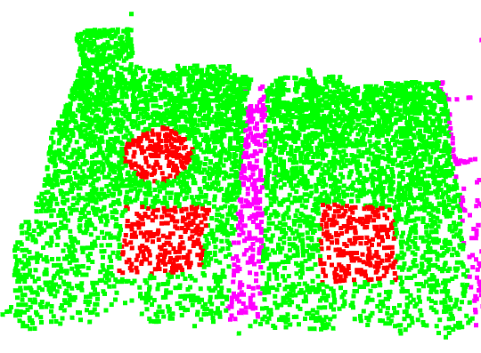

**3D Workspace Exploration**
This repository focuses on 3D semantic segmentation of a robotic workspace using point cloud data. The goal is to segment and understand various components in a 3D environment to facilitate robotic perception and interaction.
The repo is based on [Repository Name](https://github.com/drprojects/DeepViewAgg).

⚠️ For generating 3D synthetic training data, please refer to the companion repository [Repository Name](https://github.com/vinayakabhatkale/3D-synthetic-pointcloud-generation).

📦 **Docker Setup**
To ensure a reproducible environment, this project is containerized using Docker.

1. Build the Docker container
```
docker build -t workspace_container .
```

2. Start the container
Use the provided script to start the container:

```
./start.sh
```

3. Restart an existing container
If you exited the container and want to re-enter it:

```
./restart.sh
```

**Subscribe and receive the pointcloud from [Repository Name](https://github.com/vinayakabhatkale/3D-synthetic-pointcloud-generation)**
Subscribe the data from the repo which generates the 3D semantic training dataset

Go to  [this](./torch_points3d/datasets/segmentation/utils) 

Run the script to receive the generated data
```
BlendTorchSubscriber.py
```


🏋️ **Training**
Once inside the container, you can run the training script upon running the 

```
DataProvider.py
```
which prepares the dataset for the training. Change the data related to dataset path here.


```
python train.py
```

**Output**
Training logs, model checkpoints, and visualizations are saved in the output/ directory.

**Evaluation**
To evaluate a trained model:

```
python eval.py
```

**Results will be stored in the output/ folder as well.**



I have used realsense camera and usually the accuracy is not excellent but still considerably good because of the quality of the dataset.


```
📂 Directory Structure
php
Copy
Edit
.
├── Dockerfile
├── start.sh
├── restart.sh
├── train.py
├── eval.py
├── output/               # Logs, checkpoints, visualizations
├── data/                 # Place training data here
└── README.md
```


The repo is based on Deepviewagg and used as a 3D robotic workspace exploration using semantic segmentation.
 @article{robert2022dva,
  title={Learning Multi-View Aggregation In the Wild for Large-Scale 3D Semantic Segmentation},
  author={Robert, Damien and Vallet, Bruno and Landrieu, Loic},
  journal={Proceedings of the IEEE/CVF Conference on Computer Vision and Pattern Recognition},
  year={2022}


📃 License
This project is released under the MIT License.
